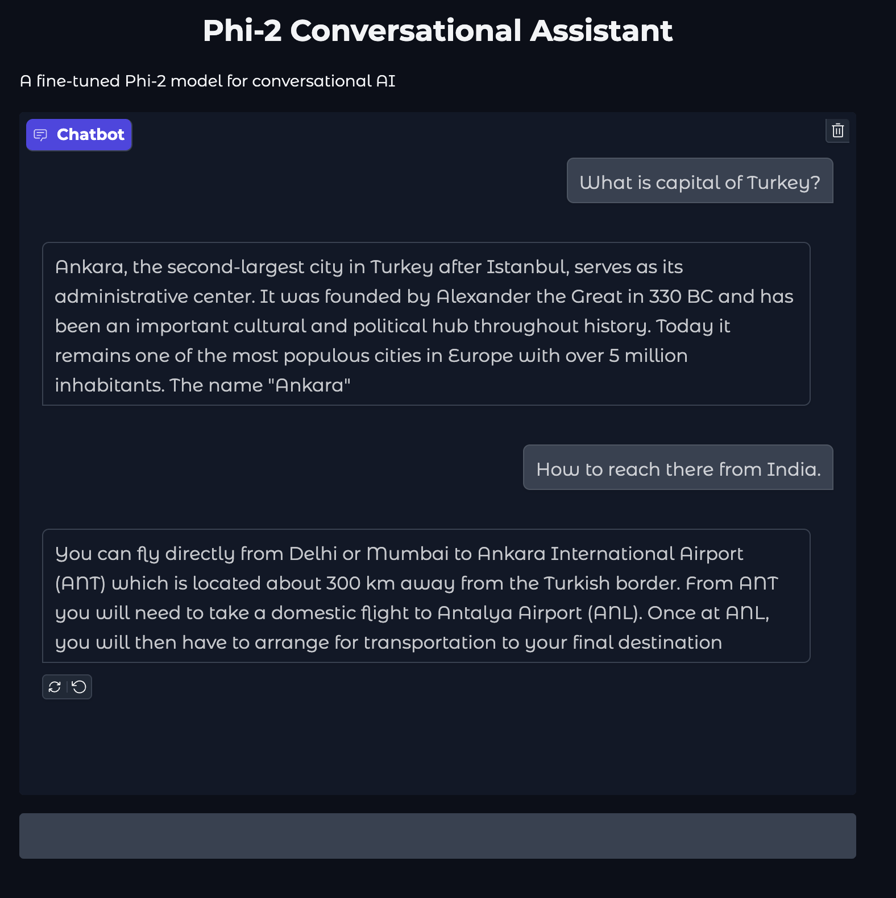
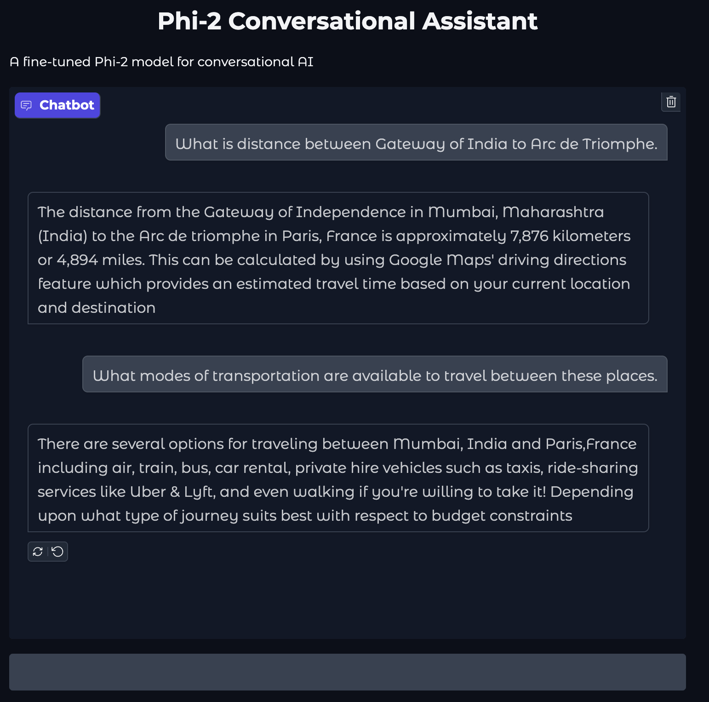

# Phi-2 Conversational Assistant

A fine-tuned version of Microsoft's Phi-2 model for conversational AI using QLoRA (Quantized Low-Rank Adaptation) and instruction tuning.

## Project Overview

This project consists of two main components:
1. Training script (`train.py`): Fine-tunes the Phi-2 model using the OpenAssistant dataset
2. Web Interface (`app.py`): Provides a chat interface using Gradio

## Features

- Instruction-tuned conversational AI
- Efficient fine-tuning using QLoRA
- Web-based chat interface
- Context-aware responses
- Configurable response length and temperature
- CPU/GPU compatible

## Setup

1. Install dependencies:
```bash
pip install -r requirements.txt
```

2. Run the training script (optional, if you want to retrain):
```bash
python train.py
```

3. 3. Launch the chat interface:
```bash
python app.py
```

## Web Interface
The web interface allows you to interact with the fine-tuned Phi-2 model. You can:
- Type messages in the text box
- Use example prompts provided
- View conversation history in the chat window





## Model Details
- Base Model: Microsoft Phi-2
- Fine-tuning Method: QLoRA
- Training Dataset: OpenAssistant/oasst1
- Adapter Location: phi2-finetuned-final/

## Usage
After starting the app, you can:
- Access the chat interface through your browser
- Type messages in the text box
- Use example prompts provided
- View conversation history in the chat window

## Configuration
The model is configured with:
- Max response length: 64 tokens
- Context window: 512 tokens
- Temperature: 0.6
- Top-p: 0.7
- Early stopping enabled
- Repetition penalty: 1.2

## Project Structure
```
.
├── app.py              # Gradio web interface
├── train.py            # Training script
├── requirements.txt    # Project dependencies
└── phi2-finetuned-final/  # Fine-tuned model files
```
## License
This project uses the Phi-2 model which is subject to Microsoft's license terms.
